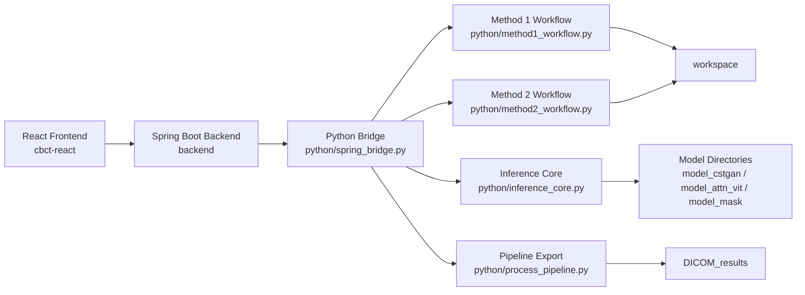

# CBCT → CT Research Workstation

这是一个本地运行的医学影像研究工作站，用于把原本分散的 CBCT → CT 推理、后处理、数据集制作和 DICOM 导出流程，整合成一个可操作的全栈系统。

项目当前以本地研究环境为主，核心价值不只是单个模型，而是：

- 用 React 搭建了可操作的多页面前端
- 用 Spring Boot 把前端请求统一编排成 API
- 用 Python 承载真实的影像处理、推理与 DICOM 处理逻辑
- 把模型目录、处理目录、配置文件和导出流程串成一套完整的本地工作站

## 项目状态

这个仓库公开的是：

- 前端代码
- 后端代码
- Python 工作流代码
- 三套模型工程目录结构
- 本地运行所依赖的核心配置文件

这个仓库**不包含**：

- 原始 DICOM 数据
- 训练/测试数据集
- 模型 `checkpoints`
- 已生成的 `results`
- `workspace` 和 `DICOM_results` 中的实际输出内容

因此，这个仓库更适合用来展示：

- 系统是如何搭起来的
- 四个页面分别负责什么
- 本地运行依赖哪些目录
- 哪些地方存在路径硬编码和环境依赖

它**不等同于**一个拿下来就能完整复现全部流程的公开 release。

## 四个界面

当前前端包含四个核心页面，对应 `cbct-react/src/pages/` 下的四个入口页面。

### 1. 推理与结果整理

对应页面：`PipelineRunner.tsx`

用途：

- 选择模型目录
- 选择模型类型
- 选择数据集范围
- 指定 GPU
- 执行推理
- 读取流式日志
- 执行 merge

后端相关接口：

- `/api/inference/run`
- `/api/inference/stream`
- `/api/inference/merge`

Python 相关入口：

- `python/inference_core.py`
- `python/extract_and_merge.py`
- `python/spring_bridge.py`

### 2. DICOM 导出

对应页面：`DicomGenerator.tsx`

用途：

- 选择模型目录
- 选择模型类型
- 选择数据集
- 指定 GPU
- 触发从 raw/推理结果到 DICOM 序列的恢复流程

后端相关接口：

- `/api/dicom/export`
- `/api/pipeline/run`

Python 相关入口：

- `python/process_pipeline.py`
- `python/config.py`

### 3. 数据集制作（ORB）

对应页面：`Method1DatasetBuilder.tsx`

用途：

- 基于 ORB 的病人 / CBCT / QACT 配对
- DICOM → raw
- 插值
- ROI 选择
- shift 检测
- 手工微调
- 回插验证
- 自动生成 `patient_params.json` / `Patient_rename.json` 建议条目

后端相关接口：

- `/api/method1/defaults`
- `/api/method1/run_match`
- `/api/method1/roi_options`
- `/api/method1/step1` ~ `/api/method1/step6`

Python 相关入口：

- `python/method1_workflow.py`
- `python/spring_bridge.py`

### 4. 数据集制作（SITK）

对应页面：`Method2DatasetBuilder.tsx`

用途：

- 基于 SimpleITK 的配准与数据集制作流程
- match
- raw 生成
- ROI / Patient mask
- registration
- transform1212
- 回插验证
- JSON 参数总结

后端相关接口：

- `/api/method2/defaults`
- `/api/method2/run_match`
- `/api/method2/roi_options`
- `/api/method2/step1` ~ `/api/method2/step6`

Python 相关入口：

- `python/method2_workflow.py`
- `python/method1_workflow.py`
- `python/spring_bridge.py`

## 总体架构

你也可以直接阅读更详细的文档：

- [docs/architecture.md](docs/architecture.md)
- [docs/hardcoded-configs.md](docs/hardcoded-configs.md)
- [docs/directory-guide.md](docs/directory-guide.md)
- [docs/local-workflow.md](docs/local-workflow.md)

## 仓库目录概览

顶层目录如下：

- `backend/`：Spring Boot 后端
- `cbct-react/`：React 前端
- `python/`：Python 工作流与桥接逻辑
- `model_cstgan/`：第一类模型工程目录
- `model_attn_vit/`：第二类模型工程目录
- `model_mask/`：第三类模型工程目录
- `workspace/`：本地处理中间产物目录（当前仅保留空目录）
- `DICOM_results/`：DICOM 输出目录（当前仅保留空目录）

详细说明请看：

- [docs/directory-guide.md](docs/directory-guide.md)

## 当前仓库最重要的限制

### 1. 依赖本地路径

项目里存在大量绝对路径和默认路径，例如：

- `G:/CBCTtoCT_Spring/...`
- `G:/CBCTtoCT/...`
- `G:/mimi0209/...`
- `F:/mimi0209/...`

这些路径不是占位文字，而是当前本地环境真实使用的路径。

### 2. 依赖真实配置文件

以下文件会直接参与运行：

- `python/patient_params.json`
- `python/Patient_rename.json`
- `backend/src/main/resources/application.yml`
- `python/config.py`

### 3. 依赖外部数据和模型权重

虽然本仓库包含模型工程目录，但不包含实际权重和数据，因此：

- 别人可以看懂结构
- 可以理解系统设计
- 但无法在没有额外资源的情况下完整复现结果

## 建议阅读顺序

如果你是第一次看这个仓库，建议按下面顺序阅读：

1. `README.md`
2. `docs/architecture.md`
3. `docs/directory-guide.md`
4. `docs/hardcoded-configs.md`
5. `docs/local-workflow.md`

## 后续展示建议

当前最适合的公开展示方式不是在线 demo，而是：

- 本地运行录制 demo 视频
- 在 GitHub README 里说明四个页面与系统结构
- 在视频里展示默认参数执行流程

这能最大程度展示系统能力，同时避免在论文发表前过早公开数据和完整可复现实验资产。
