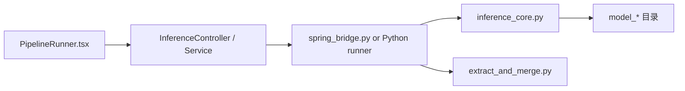
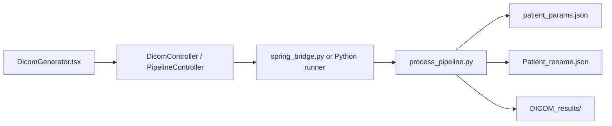
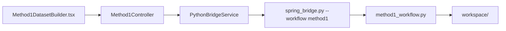

# 系统架构说明

本文档解释这个项目是如何从前端、后端、Python 脚本和模型目录拼接成一套本地工作站的。

## 1. 组件分层

整个系统可以分成四层：

1. 前端展示与操作层
2. 后端接口与编排层
3. Python 桥接与工作流层
4. 模型与本地数据目录层

### 前端层：`cbct-react/`

前端是一个 React + Vite 应用，主要负责：

- 让用户通过页面操作流程
- 提交参数给后端
- 展示日志
- 展示步骤结果
- 组织四个页面的导航

入口文件：

- `cbct-react/src/App.tsx`

它定义了四个页面路由：

- `/` → `PipelineRunner`
- `/dicom` → `DicomGenerator`
- `/method1` → `Method1DatasetBuilder`
- `/method2` → `Method2DatasetBuilder`

### 后端层：`backend/`

后端是 Spring Boot 工程，主要负责：

- 对外暴露统一 API
- 接收前端参数
- 调用 Python 进程
- 把 Python 的输出包装为接口响应
- 在需要时以流式方式把日志回传给前端

核心控制器在：

- `backend/src/main/java/com/cbct/cbct_backend/controller/`

主要包括：

- `InferenceController`
- `DicomController`
- `PipelineController`
- `Method1Controller`
- `Method2Controller`

### Python 桥接层：`python/spring_bridge.py`

这是整个系统最关键的衔接点之一。

它的作用不是做具体算法，而是：

- 接收 Spring 传来的命令行参数
- 判断当前属于哪一种 workflow
- 把请求分发到真正的业务脚本

支持的 workflow 有：

- `method1`
- `method2`
- `inference`
- `dicom`
- `pipeline`

这意味着 Spring 后端和 Python 业务逻辑之间并不是直接耦合在每个脚本上，而是先经过一个统一桥接层。

### Python 工作流层

真正的图像处理、推理和导出逻辑主要分散在这些文件里：

- `python/method1_workflow.py`
- `python/method2_workflow.py`
- `python/inference_core.py`
- `python/extract_and_merge.py`
- `python/process_pipeline.py`
- `python/config.py`

它们大致分工如下：

#### `method1_workflow.py`

负责 ORB 路线的数据集制作流程，包括：

- 匹配病人和扫描序列
- DICOM → raw
- 插值
- ROI 处理
- shift 检测
- 中间结果回插与验证
- 生成 JSON 建议条目

#### `method2_workflow.py`

负责 SITK 路线的数据集制作流程，包括：

- 复用部分 method1 的前置步骤
- SITK registration
- transform1212
- 回插验证
- 生成 JSON 建议条目

#### `inference_core.py`

负责模型推理主流程，包括：

- 根据 `modelDir` / `modelKind` 决定使用哪一种模型工程目录
- 设置运行命令
- 执行推理
- 支持普通返回和流式返回

#### `extract_and_merge.py`

负责 merge 阶段的整理工作，把推理后的若干中间产物整合进指定目录结构。

#### `process_pipeline.py`

负责从处理后的 raw 结果恢复到 DICOM 输出目录，属于后处理 / 导出阶段的关键脚本。

#### `config.py`

负责统一管理路径与环境依赖，是整个 Python 层的路径配置中心。

## 2. 页面到脚本的映射关系

### 页面一：推理与结果整理

前端页面：

- `cbct-react/src/pages/PipelineRunner.tsx`

后端主要接口：

- `/api/inference/run`
- `/api/inference/stream`
- `/api/inference/merge`

Python 入口：

- `python/inference_core.py`
- `python/extract_and_merge.py`

典型流向：

### 页面二：DICOM 导出

前端页面：

- `cbct-react/src/pages/DicomGenerator.tsx`

后端主要接口：

- `/api/dicom/export`
- `/api/pipeline/run`

Python 入口：

- `python/process_pipeline.py`

典型流向：

### 页面三：数据集制作（ORB）

前端页面：

- `cbct-react/src/pages/Method1DatasetBuilder.tsx`

后端主要接口：

- `/api/method1/*`

Python 入口：

- `python/method1_workflow.py`

典型流向：

### 页面四：数据集制作（SITK）

前端页面：

- `cbct-react/src/pages/Method2DatasetBuilder.tsx`

后端主要接口：

- `/api/method2/*`

Python 入口：

- `python/method2_workflow.py`

典型流向：

## 3. 模型目录在架构中的角色

顶层三个模型目录：

- `model_cstgan/`
- `model_attn_vit/`
- `model_mask/`

在系统里并不是一个“可独立上线的模型服务”，而是本地 Python 工程的一部分。

这些目录主要提供：

- `models/`：模型结构定义
- `options/`：运行参数和配置
- `data/`：数据集加载逻辑
- `util/`：工具函数
- `train.py` / `test.py`：训练与测试入口

这意味着当前项目的推理能力并不是直接内嵌在 Spring 或 React 中，而是依赖这些模型工程目录，并由 Python 工作流在本地调用。

## 4. 这个系统为什么是“工作站”而不是单个 demo

这个项目的重点并不是一个孤立的模型页面，而是把研究工作中的多个步骤整合成统一操作入口。

它具备以下特征：

- 有前端页面组织复杂流程
- 有后端 API 编排 Python 调用
- 有本地路径和工作目录体系
- 有中间结果与最终导出目录
- 有与 DICOM 恢复相关的后处理逻辑

因此，这个项目更接近：

- 研究工作站
- 本地实验操作平台
- 流程编排工具

而不是：

- 单纯的在线图片增强 demo
- 单纯的模型权重仓库

## 5. 相关文档

配套说明文档如下：

- [hardcoded-configs.md](hardcoded-configs.md)
- [directory-guide.md](directory-guide.md)
- [local-workflow.md](local-workflow.md)
