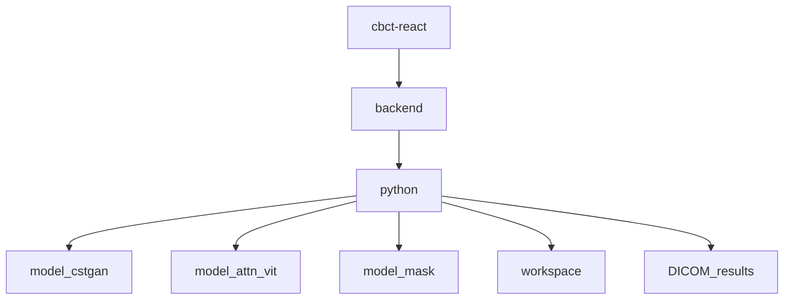

# 目录说明

本文档解释当前仓库顶层各目录的用途，以及这些目录在本地研究工作流中分别承担什么角色。

## 顶层目录

### `backend/`

这是 Spring Boot 后端工程。

主要作用：

- 暴露 API 给前端调用
- 启动 Python 进程
- 编排 workflow 请求
- 做统一的响应包装
- 在需要时将日志以流式形式返回给前端

关键子目录：

- `src/main/java/com/cbct/cbct_backend/controller/`
  放接口控制器
- `src/main/java/com/cbct/cbct_backend/service/`
  放 Python 调用和业务编排逻辑
- `src/main/resources/application.yml`
  放路径配置

### `cbct-react/`

这是 React 前端工程。

主要作用：

- 提供四个功能页面
- 组织导航
- 采集表单参数
- 调用后端 API
- 展示日志与步骤输出

关键子目录：

- `src/App.tsx`
  路由总入口
- `src/pages/`
  四个页面的核心逻辑
- `package.json`
  前端依赖与脚本

### `python/`

这是整个项目最核心的工作流层。

主要作用：

- 承载 Python 处理逻辑
- 在 Spring 与具体脚本之间做桥接
- 处理推理、数据集制作、导出与 DICOM 恢复

关键文件：

- `spring_bridge.py`
  Spring 到 Python 的总入口
- `config.py`
  Python 侧路径配置中心
- `inference_core.py`
  推理主逻辑
- `process_pipeline.py`
  DICOM 恢复主逻辑
- `method1_workflow.py`
  ORB 数据集制作
- `method2_workflow.py`
  SITK 数据集制作
- `patient_params.json`
  病人参数配置
- `Patient_rename.json`
  DICOM UID 映射配置

### `model_cstgan/`

这是第一类模型工程目录。

当前仓库中保留的是结构代码，不包含：

- `checkpoints/`
- `results/`

它内部通常包含：

- `data/`
  数据读取相关逻辑
- `datasets/`
  数据集或样本组织相关资源
- `models/`
  模型结构代码
- `options/`
  配置与参数解析
- `util/`
  工具函数
- `app.py`
  可能的入口或实验脚本
- `train.py`
  训练入口
- `test.py`
  测试/推理入口
- `test_simple.py`
  简化测试入口

### `model_attn_vit/`

这是第二类模型工程目录。

当前仓库中保留的是结构代码，不包含：

- `checkpoints/`
- `results/`

它内部通常包含：

- `data/`
- `models/`
- `options/`
- `util/`
- `uvcgan/`
- `train.py`
- `test.py`

### `model_mask/`

这是第三类模型工程目录。

当前仓库中保留的是结构代码，不包含：

- `checkpoints/`
- `results/`

它内部通常包含：

- `data/`
- `models/`
- `options/`
- `scripts/`
- `util/`
- `train.py`
- `test.py`

### `workspace/`

这是本地工作区目录。

在完整本地运行时，它通常会存放：

- 匹配结果
- 中间 raw 文件
- 方法一 / 方法二各步骤生成的中间产物
- 配准结果
- 回插验证结果
- 某些临时日志或步骤元数据

当前仓库里这个目录是空的，只用于保留目录结构概念。

### `DICOM_results/`

这是导出后的 DICOM 结果目录。

在完整本地运行时，它通常会存放：

- 按模型区分的输出结果目录
- 每个病人对应的 `updated_CBCT_DICOM_*`
- 最终写出的 DICOM 序列

当前仓库里这个目录是空的，只用于保留目录结构概念。

## 目录之间的关系

可以用下面这张图来理解：

解释如下：

- 前端负责发起操作
- 后端负责接收请求并调用 Python
- Python 负责操作模型目录并读写本地工作区
- 工作流中间产物进入 `workspace`
- 最终 DICOM 导出进入 `DICOM_results`

## 哪些目录是“代码”，哪些目录是“运行时目录”

### 代码目录

- `backend/`
- `cbct-react/`
- `python/`
- `model_cstgan/`
- `model_attn_vit/`
- `model_mask/`

### 运行时目录

- `workspace/`
- `DICOM_results/`

理解这点很重要，因为这也是这个仓库当前“可看结构但不可完整复现”的原因之一：

- 代码已经在仓库里
- 但运行时产生的数据和结果没有在仓库里

## 推荐阅读顺序

建议按以下顺序查看这些目录：

1. `backend/`
2. `cbct-react/`
3. `python/`
4. `model_*`
5. `workspace/`
6. `DICOM_results/`

如果想继续理解本地运行依赖，请接着看：

- [local-workflow.md](local-workflow.md)
